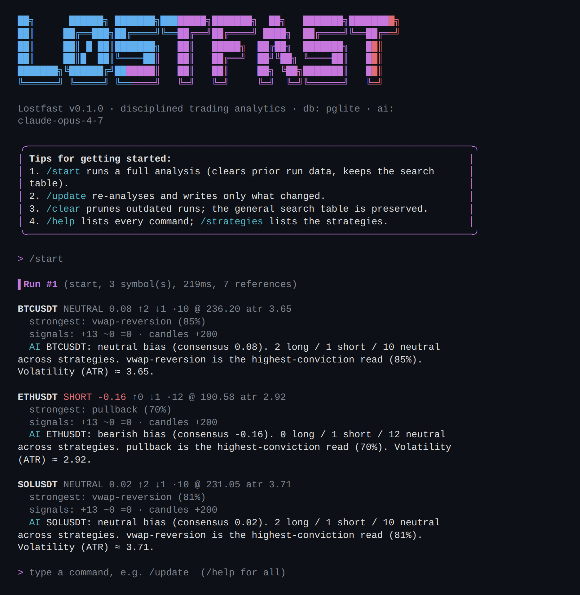
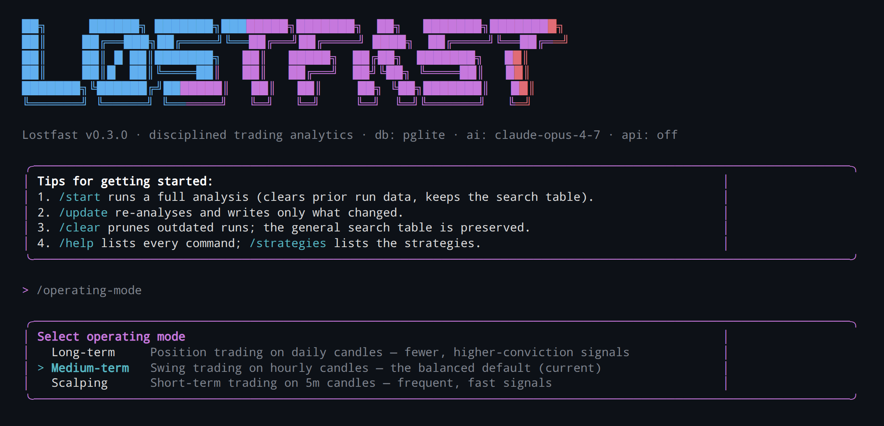

# LØSTFΛST

> A disciplined crypto market-research CLI — strategies, analytics, risk and
> AI-assisted research — in the style of the [Gemini CLI](https://github.com/google-gemini/gemini-cli).

LØSTFΛST fetches OHLCV candles, runs **13 trading strategies** over them,
sizes positions with volatility-aware risk management, indexes a knowledge base,
optionally scrapes references and crawls market news with Playwright, and
narrates the result through a pluggable AI advisor — all from a polished
interactive terminal UI.



---

## Highlights

- **Gemini-CLI-style UI** built with [Ink](https://github.com/vadimdemedes/ink) +
  React: a gradient `LØSTFΛST` wordmark, command autocomplete, switchable
  colour themes, a live progress spinner and a scrolling transcript.
- **13 strategies** computed from textbook technical indicators (SMA, EMA, RSI,
  ATR, Bollinger, MACD, Stochastic, VWAP, Donchian, OLS slope).
- **Exact money math** — every value that touches money or position sizing runs
  through a 64-digit [Math.js](https://mathjs.org) `BigNumber` instance, so
  `0.1 + 0.2 === 0.3` exactly and quantities are reproducible.
- **Drizzle ORM** on PostgreSQL — runs on an **embedded PGlite** database with
  zero configuration, or on a real PostgreSQL server via `DATABASE_URL`.
- **Interactive command set with precise lifecycle rules**: `/start`, `/update`,
  `/backtest`, `/news`, `/clear`, `/status`, `/strategies`, `/theme`,
  `/operating-mode`, `/api`, `/help`, `/exit`.
- **Selectable operating modes**: `/operating-mode` opens a pop-up to switch the
  trading style between **long-term**, **medium-term** and **scalping**, so the
  platform is no longer locked to a single horizon.
- **Walk-forward backtester**: `/backtest` replays history with the *same*
  forecast logic the Trade Log shows and reports win rate, expectancy and profit
  factor — so the forecasts can be validated against real price action instead of
  trusted blindly.
- **News crawler**: Playwright-backed source collection driven by
  `src/config/news-sources.json`, with per-source limits and resilient failures.
- **Five pillars**: market math, analytics, search, scraping/news crawling
  (Playwright) and an AI advisor — each behind a small interface,
  dependency-injected and testable.
- **Works offline or live**: deterministic synthetic market data keeps CI and
  demos reproducible; Binance, CoinGecko and MEXC adapters can pull real crypto
  market rates.
- **In-process NestJS GraphQL backend**: the interactive CLI starts a local
  GraphQL endpoint without a second service process.
- **Dockerised**: `docker compose up` brings up PostgreSQL and the CLI.

---

## Quick start

Requires **Node.js ≥ 20**.

```bash
npm install          # install dependencies
npm run dev          # launch the interactive CLI (tsx, no build needed)
```

Inside the shell, type a command:

```
> /start
```

### One-shot / scripted runs

Every command also works non-interactively, printing plain text (ideal for CI,
cron or Docker):

```bash
npm run build                 # bundle to dist/index.js
node dist/index.js start      # run a full analysis and exit
node dist/index.js backtest   # replay history and print forecast accuracy
node dist/index.js status     # print table counts + latest analytics
node dist/index.js strategies # list strategies
node dist/index.js news       # crawl configured market news sources
```

Want a fully deterministic, offline run? Use the synthetic market source:

```bash
LOSTFAST_MARKET_SOURCE=synthetic LOSTFAST_DATA_DIR=:memory: node dist/index.js start
```

---

## Commands

| Command        | What it does                                                                 |
| -------------- | ---------------------------------------------------------------------------- |
| `/start`       | Run a full analysis. **Clears prior run data first**, then collects afresh. The general search table is **never** wiped. |
| `/update`      | Re-analyse and persist **only what changed** (diff-aware upserts).           |
| `/backtest`    | Replay history and report how often each forecast's take-profit was reached **before** its stop-loss (win rate, expectancy, profit factor). |
| `/news`        | Crawl configured market news and economic-calendar sources into `news_items`. |
| `/clear`       | Prune outdated runs, keeping the latest run and the general search table.    |
| `/status`      | Show per-table row counts and the latest run's analytics.                    |
| `/strategies`  | List every available strategy.                                               |
| `/theme [name]`| Open the selector window, or switch directly by name (`violet`, `ocean`, `ember`, `forest`, `mono`). |
| `/operating-mode [name]` | Open the trading-style selector pop-up, or switch directly by name (`long-term`, `medium-term`, `scalping`). Applies that horizon's timeframe. |
| `/operating-mode-time [tf]` | Open the timeframe selector, or set it directly (`1m`–`1d`) to fine-tune within the current mode. |
| `/api`         | Show the in-process GraphQL endpoint.                                        |
| `/help`        | Show the command list.                                                       |
| `/exit`        | Quit (aliases: `/quit`, `/q`, `Esc`, `Ctrl+C`).                              |

The leading slash is optional. The "general search results" table
(`search_results`) is the one table that **survives `/start` and `/clear`** — it
accumulates discoveries across every session, exactly as required.
Collected `news_items` also survive these lifecycle commands so news history can
feed a future market-assessment model.

While typing a command, Lostfast shows matching command suggestions. Press
`Tab` to complete an unambiguous command prefix. Run `/theme` to open the theme
selector window, or pass a theme name for one-shot switching.


### Operating modes

Lostfast is no longer locked to a single trading horizon. Run `/operating-mode`
to open a pop-up and pick a trading style — **long-term**, **medium-term** or
**scalping** — and the analysis timeframe shifts to match (daily, hourly or 5m
candles, respectively). On first launch the pop-up opens automatically so you
choose a style before starting; your choice is remembered across sessions. Use
`/operating-mode-time` afterwards to fine-tune the exact timeframe within a mode.



---

## Strategies

All strategies share the same `Strategy` interface (`id`, `title`, `minCandles`,
`evaluate`) and are pure and stateless — the same candles always yield the same
signal.

| Id                    | Strategy                       | Core idea                                            |
| --------------------- | ------------------------------ | ---------------------------------------------------- |
| `trend-following`     | Trend Following                | Price above SMA20 & SMA50 with positive OLS slope    |
| `mean-reversion`      | Mean Reversion (Bollinger)     | Fade Bollinger-band extremes back to the mean        |
| `breakout`            | Breakout                       | Enter as price clears a recent range high/low        |
| `scalping-momentum`   | Scalping Momentum (RSI)        | Short-term RSI thrust with momentum confirmation     |
| `smart-money`         | Smart Money Concept (BOS)      | Break-of-structure / liquidity shifts                |
| `support-resistance`  | Support & Resistance           | Reactions at clustered supply/demand levels          |
| `pullback`            | Pullback                       | Buy dips / sell rallies within a trend               |
| `macd-momentum`       | MACD Momentum                  | Signal-line crossovers and histogram expansion       |
| `donchian-breakout`   | Donchian Breakout (Turtle)     | Classic channel breakout                             |
| `bollinger-squeeze`   | Bollinger Squeeze              | Low-volatility contraction preceding expansion       |
| `stochastic-reversal` | Stochastic Reversal            | %K/%D crosses in overbought/oversold zones           |
| `vwap-reversion`      | VWAP Reversion                 | Reversion toward intraday fair value                 |
| `grid`                | Grid (Range)                   | Harvest oscillation in sideways regimes              |

The `StrategyEngine` runs them all, aggregates a strength-weighted **consensus
score** in `[-1, 1]`, and exposes the strongest signal. A failing strategy
degrades to a neutral signal rather than taking the whole run down.

### Calculation accuracy

- **Indicators** operate on native `number` arrays (the standard for technical
  analysis) but borrow `mean`/`std` from Math.js so the formulas are exactly the
  textbook ones. RSI and ATR use Wilder smoothing; Bollinger uses the population
  standard deviation; EMA is seeded with the SMA of the first window to avoid
  first-price drift. Every series returns the same length as its input, padded
  with `NaN` for "not enough data yet".
- **Money & position sizing** run through a dedicated 64-digit Math.js
  `BigNumber` instance (`src/strategies/mathx.ts`). Position size is
  `quantity = (equity × risk%) / stopDistance`, with an ATR-based stop fallback
  and a 2 % hard-stop fallback. These paths are covered by exactness tests.

---

## Backtesting forecast accuracy

A forecast is only as trustworthy as its track record, so `/backtest` measures
that record directly. It is a **walk-forward** simulation: for every evaluable
bar it rebuilds the exact forecast a user would have seen at that moment
(`buildForecast` over the candles known *up to that point*), then replays the
*future* bars to decide whether the take-profit or the stop-loss was hit first.

The forecast logic is shared with the Trade Log through a single source of truth
(`src/strategies/forecast.ts`), so the metrics describe the live system — not a
different model fit to history. The simulation is deliberately conservative:

- **No look-ahead.** A forecast made on the close of bar `i` is resolved only
  against bars `> i`.
- **Non-overlapping trades.** The next entry is considered only after the
  previous trade closes.
- **Stop-first tie-break.** When a single bar straddles both levels, the stop is
  assumed to fill first, so the reported edge is never flattering.

Each trade is scored in **R-multiples** (multiples of the risked stop distance):
a take-profit at the 2:1 target earns `+2R`, a stop costs `−1R`. The report rolls
these up per symbol and across the portfolio:

```bash
node dist/index.js backtest
```

```
Backtest — forecast accuracy (TP before SL)
╭──────────┬────────┬───────┬─────────┬───────────────╮
│ Currency │ Trades │ Win % │ Exp (R) │ Profit factor │
├──────────┼────────┼───────┼─────────┼───────────────┤
│ SOLUSDT  │ 12     │ 41.7% │ +0.18   │ 1.31          │
│ ETHUSDT  │ 9      │ 33.3% │ -0.05   │ 0.92          │
├──────────┼────────┼───────┼─────────┼───────────────┤
│ TOTAL    │ 21     │ 38.1% │ +0.08   │ 1.13          │
╰──────────┴────────┴───────┴─────────┴───────────────╯
```

- **Win %** — winning trades / decided trades (TP or SL; timeouts excluded).
- **Exp (R)** — mean R per trade, the system's expectancy. Positive is an edge.
- **Profit factor** — gross winning R / gross losing R; `> 1` is profitable,
  `∞` when nothing lost.

Use it before trading a symbol: a negative expectancy or a profit factor below 1
means the forecasts have *not* held up on that instrument's recent history.

---

## Architecture

Clean architecture with small, single-purpose files (SOLID, dependency
injection throughout):

```
src/
  domain/       Candle, Money, Signal, Symbol — pure types & value objects
  strategies/   indicators, mathx, position-sizer, 13 strategy implementations,
                the engine, registry and forecast (the trade the system suggests)
  risk/         risk limits, validator and the strategy↔risk orchestrator
  db/           Drizzle schema, the driver-agnostic client, the LostfastStore
  services/     market-data, analytics, backtest, search, scraping/news, ai-advisor
  backend/      NestJS + Apollo GraphQL wrapper around the Lostfast facade
  pipeline/     CollectionPipeline — orchestrates a full run end to end
  app/          Lostfast facade (owns the db, store and pipeline)
  cli/          Ink UI: ascii banner, theme, App, Banner, output views, commands
  config.ts     environment-driven configuration
  index.tsx     entrypoint (interactive UI + headless subcommands)
```

The same `Lostfast` facade backs both the interactive shell and the headless
subcommands, so behaviour can never drift between them.

---

## Database

Drizzle ORM (PostgreSQL dialect). The identical schema runs on the embedded
PGlite database (default) and on a real PostgreSQL server.

| Table            | Pillar     | Notes                                                        |
| ---------------- | ---------- | ------------------------------------------------------------ |
| `runs`           | lifecycle  | One row per `/start` or `/update` execution                  |
| `candles`        | math       | Raw OHLCV; unique on `(symbol, interval, open_time)`         |
| `signals`        | analytics  | Strategy outputs; unique on `(run, symbol, strategy)`        |
| `analytics`      | analytics  | Aggregated consensus per symbol per run                      |
| `scrapes`        | scraping   | Playwright page text, deduplicated by content hash           |
| `ai_insights`    | AI         | Advisor summaries per symbol per run                         |
| `search_results` | search     | **The general table — survives `/start` and `/clear`**       |
| `news_items`     | news       | Configured source headlines/events for future assessment      |

`/start` wipes the ephemeral tables (`signals`, `analytics`, `scrapes`,
`ai_insights`, `candles`, `runs`); `/clear` keeps only the most recent run. The
`search_results` and `news_items` tables are excluded from both.

Migrations live in `drizzle/` and are applied automatically on connect. To
regenerate them after a schema change:

```bash
npm run db:generate
```

---

## Configuration

All configuration is environment-driven (see `.env.example`):

| Variable                  | Default                       | Purpose                                                        |
| ------------------------- | ----------------------------- | -------------------------------------------------------------- |
| `DATABASE_URL`            | _(unset → PGlite)_            | PostgreSQL connection string. Unset uses embedded PGlite.      |
| `LOSTFAST_DATA_DIR`       | `.lostfast/pgdata`            | PGlite data directory (`:memory:` for ephemeral).              |
| `LOSTFAST_MARKET_SOURCE`  | `resilient`                   | `resilient` \| `live` \| `binance` \| `coingecko` \| `mexc` \| `synthetic`. |
| `LOSTFAST_MARKET_API`     | `https://api.binance.com`     | Binance REST base URL.                                         |
| `LOSTFAST_COINGECKO_API`  | `https://api.coingecko.com`   | CoinGecko REST base URL.                                       |
| `LOSTFAST_MEXC_API`       | `https://api.mexc.com`        | MEXC REST base URL.                                            |
| `LOSTFAST_SYMBOLS`        | `BTCUSDT,ETHUSDT,SOLUSDT`     | Comma-separated symbols to analyse.                            |
| `LOSTFAST_INTERVAL`       | `1h`                          | Candle interval.                                               |
| `LOSTFAST_MODE`           | `medium-term`                 | Initial operating mode (`long-term`, `medium-term`, `scalping`). |
| `LOSTFAST_CANDLE_LIMIT`   | `200`                         | Number of candles to fetch per symbol.                         |
| `LOSTFAST_ACCOUNT_BALANCE`| `10000`                       | Account equity used for position sizing.                       |
| `LOSTFAST_THEME`          | `violet`                      | Initial CLI theme.                                             |
| `LOSTFAST_API`            | `1`                           | Start the in-process GraphQL API with the interactive CLI.      |
| `LOSTFAST_API_HOST`       | `127.0.0.1`                   | GraphQL bind host.                                             |
| `LOSTFAST_API_PORT`       | `0`                           | GraphQL bind port (`0` selects a free port).                    |
| `LOSTFAST_SCRAPE`         | `0`                           | Set to `1` to enable the Playwright scraping pillar.           |
| `LOSTFAST_NEWS_SOURCES_FILE` | `src/config/news-sources.json` | Optional custom JSON source list for `/news`.                |
| `LOSTFAST_NEWS_LIMIT`     | `8`                           | Default max accepted items per source during `/news`.          |
| `LOSTFAST_NEWS_DEPTH`     | `2`                           | Link depth for source-local event/article crawling.            |
| `LOSTFAST_NEWS_PAGE_LIMIT`| `8`                           | Maximum pages to visit per configured news source.             |
| `LOSTFAST_NEWS_LINKS_PER_PAGE` | `6`                      | Maximum follow-up links queued from one crawled page.          |
| `ANTHROPIC_API_KEY`       | _(unset → heuristic)_        | When set, the AI advisor calls the Anthropic API.              |
| `LOSTFAST_AI_MODEL`       | `claude-opus-4-7`             | Model used by the Anthropic advisor.                           |

The market source falls back gracefully: `resilient` uses live Binance data and
transparently switches to deterministic synthetic candles if the network is
unreachable. `coingecko` uses `/api/v3/simple/price`; `mexc` uses
`/api/v3/ticker/price` and shapes the fetched spot rate into a candle series for
the strategy engine.

## GraphQL API

The interactive CLI starts the NestJS GraphQL backend in the same process by
default and prints the endpoint in the banner. Disable it with
`LOSTFAST_API=0`, or run only the API from the CLI:

```bash
node dist/index.js api
```

Available operations include `status`, `strategies`, and the `start`, `update`
and `clear` mutations.

---

## Scraping (Playwright)

The scraping pillar is **opt-in** so `/start` stays fast and fully offline by
default. Enable it with:

```bash
LOSTFAST_SCRAPE=1 node dist/index.js start
```

When enabled, it scrapes the top reference for each symbol into the `scrapes`
table using headless Chromium. Chromium is loaded lazily and the scraper
degrades gracefully (recording a marked, empty result) if the binary is missing
or a page fails to load, so a run never aborts on a flaky network. Install the
browser with:

```bash
npx playwright install chromium
```

## News Crawler

The `/news` command crawls the market/economic sources listed in
`src/config/news-sources.json` and upserts normalized items into `news_items`.
Each source has an id, title, kind, URL, enabled flag and optional per-source
limit. The default file contains the sources from issue #9:

- Investing, TradingView, Alfa-Forex and Forex Club economic calendars.
- TradingView, Investing, RBC, Kommersant, Mail.ru, LiteFinance and Euronews
  market/economics news pages.
- TradingView markets.

Run it from the interactive shell or in one-shot mode:

```bash
node dist/index.js news
```

The crawler uses a lazy headless Chromium instance, scrolls each source page,
extracts likely article/event links, then follows source-local event and article
URLs within the configured depth/page budget. Detail pages are captured from
their own heading/metadata/body text, URLs are normalized, and items are
deduplicated by source and title. A failing source is recorded in the crawl
report but does not stop the remaining sources; a failing child page is skipped.

---

## AI advisor

By default a deterministic local **heuristic advisor** narrates the analytics.
If `ANTHROPIC_API_KEY` is set, the advisor calls the Anthropic API
(`LOSTFAST_AI_MODEL`, default `claude-opus-4-7`) and falls back to the heuristic
on any error — so the CLI always produces an insight.

---

## Docker

Bring up PostgreSQL and the CLI with Docker Compose:

```bash
docker compose up -d db                 # start PostgreSQL
docker compose run --rm lostfast        # open the interactive CLI
docker compose run --rm lostfast start  # one-shot collection
```

The CLI service connects to the bundled Postgres via `DATABASE_URL` and applies
migrations automatically. To bake the Chromium binary into the image for
scraping, build with `--build-arg INSTALL_CHROMIUM=1` (also configurable in
`docker-compose.yml`).

---

## Testing

```bash
npm test          # run the full vitest suite
npm run typecheck # tsc --noEmit
```

The suite covers indicator/math accuracy, position sizing and `Money` exactness,
strategy behaviour on crafted trend/range data, the forecast brackets and the
walk-forward backtester (R-multiple math, the stop-first tie-break and the
no-look-ahead guarantee), the store's lifecycle rules (`/start` wipe, `/update`
diff, `/clear` prune) against an in-memory PGlite database, and the full
collection pipeline end to end with offline doubles.

---

## Project scripts

| Script                | Description                              |
| --------------------- | ---------------------------------------- |
| `npm run dev`         | Run the interactive CLI with `tsx`       |
| `npm run build`       | Bundle to `dist/index.js` with `tsup`    |
| `npm start`           | Run the built bundle                     |
| `npm test`            | Run the test suite                       |
| `npm run typecheck`   | Type-check without emitting              |
| `npm run db:generate` | Generate Drizzle migrations              |

---

## License

MIT.
